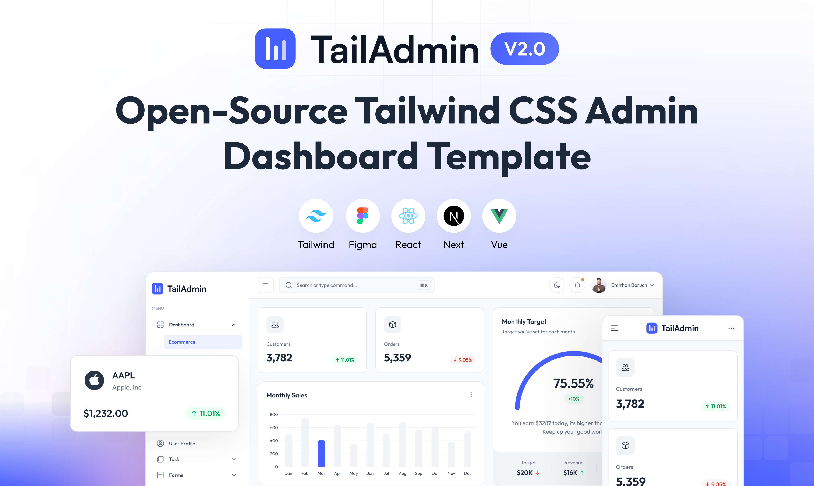

# FarmOrbit - Farm Management Platform

FarmOrbit is a comprehensive farm management platform built with **Next.js 15**, **React 19**, **TypeScript**, and **Tailwind CSS**. It provides farmers with everything they need to manage their farms, livestock, teams, and operations in one integrated platform.



## Overview

FarmOrbit helps farmers streamline their operations by providing:
- **Farm Management**: Create and manage multiple farms with detailed information
- **Team Collaboration**: Invite team members, manage roles, and collaborate effectively
- **Livestock Management**: Track animals, groups, health records, and breeding information
- **Real-time Notifications**: Stay updated with invitation acceptances, updates, and alerts
- **Modern UI**: Beautiful, responsive interface with dark mode support

## Tech Stack

FarmOrbit is built on modern, production-ready technologies:

- **Framework**: Next.js 15.x (App Router)
- **UI Library**: React 19
- **Language**: TypeScript
- **Styling**: Tailwind CSS V4
- **State Management**: Redux Toolkit
- **Backend**: Supabase (Auth + Postgres + RLS) for auth, farms, and crop farming
- **Legacy API**: `farmorb_api` (Go) — deprecated for new work; preserved on branch `legacy/go-api-integration` for livestock paths that still call Axios
- **Testing**: Cypress for E2E, Jest for unit tests

## Features

### ✅ Core Features (Implemented)

- **User Authentication**: Supabase Auth (registration, login, logout, profile)
- **Farm Management**: Create, view, edit, and archive farms (RLS + `create_farm` RPC)
- **Crop Farming**: Crop library, grow locations, plantings (with mother cycle), harvests
- **Team Collaboration**: Invite members, manage roles (livestock invite flows still legacy)
- **User Profile**: Update personal information, change password
- **Notifications**: Toast notification system with multiple notification types
- **Responsive Design**: Mobile-first approach with card layouts for small screens
- **Dark Mode**: Full dark mode support across all components

### 🚧 Coming Soon / Legacy

- **Livestock Management**: Animals, groups, health, breeding, feeding — UI still present; data layer still points at deprecated Go API until ported
- **Analytics & Reporting**: Comprehensive dashboards and data visualization

## Installation

### Prerequisites

- Node.js 20.x or later
- npm or Yarn
- A Supabase project (cloud or local CLI)

### Getting Started

1. **Clone the repository**:
   ```bash
   git clone <repository-url>
   cd farmorb_web
   ```

2. **Install dependencies**:
   ```bash
   npm install
   ```

3. **Set up environment variables**:
   ```bash
   cp .env.example .env.local
   # Set NEXT_PUBLIC_SUPABASE_URL and NEXT_PUBLIC_SUPABASE_ANON_KEY
   ```

4. **Apply database migrations** (Supabase SQL editor or CLI):
   ```bash
   # With Supabase CLI linked to your project:
   npx supabase db push
   # Or paste supabase/migrations/20260307140000_profiles_farms_crops.sql into the SQL editor
   ```

5. **Start the development server**:
   ```bash
   npm run dev
   ```

6. **Open your browser**:
   Navigate to `http://localhost:3000`

### Deprecated Go API

The dedicated Go backend (`farmorb_api`) is **no longer required** for auth, farms, or crop farming.  
If you need the previous Axios + JWT integration, use git branch `legacy/go-api-integration`.

## Project Structure

```
farmorb_web/
├── src/
│   ├── app/                    # Next.js app router pages
│   │   ├── (admin)/           # Admin pages (protected routes)
│   │   └── (full-width-pages)/ # Auth and error pages
│   ├── components/             # React components
│   │   ├── crops/             # Crop library, locations, plantings, harvests
│   │   ├── animals/           # Animal management (legacy API)
│   │   ├── auth/              # Authentication components
│   │   ├── farms/             # Farm management components
│   │   └── ui/                # Reusable UI components
│   ├── lib/supabase/          # Supabase browser/server/middleware clients
│   ├── hooks/                 # Custom React hooks
│   ├── services/              # Data services (Supabase + legacy Axios)
│   ├── store/                 # Redux store and slices
│   └── types/                 # TypeScript type definitions
├── supabase/                  # Migrations + config
├── cypress/                   # E2E tests
├── docs/                      # Documentation
└── public/                    # Static assets
```

## Development

### Available Scripts

- `yarn dev` - Start development server
- `yarn build` - Build for production
- `yarn start` - Start production server
- `yarn lint` - Run ESLint
- `yarn test` - Run tests
- `yarn test:e2e` - Run Cypress E2E tests

### Code Style

- Use TypeScript for all new files
- Follow the established typography system (see `docs/TYPOGRAPHY.md`)
- Maintain dark mode support for all components
- Use `data-testid` attributes for E2E testing
- Follow the component architecture guidelines

## Testing

FarmOrbit includes comprehensive testing:

- **E2E Tests**: Cypress tests for critical user flows
- **Integration Tests**: Real API integration tests (no mocking)
- **Unit Tests**: Component and utility function tests

See `cypress/README.md` for testing guidelines.

## Documentation

- [Supabase setup (auth + crops)](./docs/SUPABASE_SETUP.md)
- [Features Implementation Status](./docs/FEATURES.md)
- [Product Features](./docs/PRODUCT_FEATURES.md)
- [Product Roadmap](./docs/PRODUCT_ROADMAP.md)
- [Typography System](./docs/TYPOGRAPHY.md)
- Legacy Go API (deprecated): [../farmorb_api/README.md](../farmorb_api/README.md)

## Contributing

1. Follow the coding standards and conventions
2. Write tests for new features
3. Update documentation as needed
4. Ensure all tests pass before submitting

## License

FarmOrbit is released under the MIT License.

## Support

For issues, questions, or contributions, please open an issue on GitHub.

---

**FarmOrbit** - Modern farm management for the digital age 🌾
